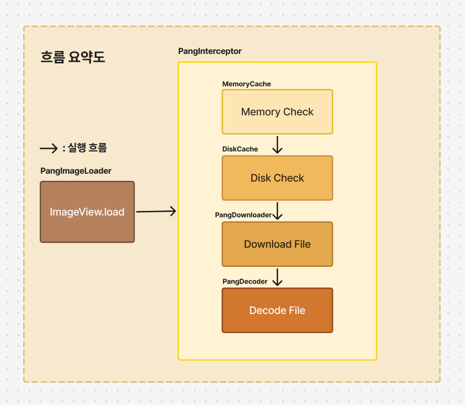
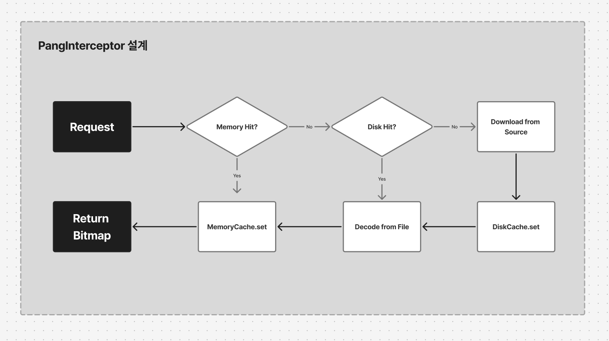

# PangImage
  

## 🚀전체 흐름도

  

## 🔁캐시 흐름도

  
  

## 📚컴포넌트 책임
| 컴포넌트 | 책임 |
| --- | --- |
| 🧠 **MemoryCache** | in-memory 캐시로, Bitmap 객체를 저장/조회 |
| 💾 **DiskCache** | 디스크 기반 캐시로, 이미지 파일의 저장, 삭제 및 조회를 담당하며 I/O 작업을 통해 캐시 용량을 관리 |
| 🌐 **PangDownloader** | 네트워크로부터 이미지 파일을 다운로드하고, HTTP 응답 상태 코드에 따른 예외 처리를 수행 |
| 🖼 **PangDecoder** | 디스크에 저장된 이미지 파일을 Bitmap으로 디코딩하며, 이미지의 크기 조정(inSampleSize, inDensity 등)을 통해 최적화된 결과 생성 |
| 🔁 **PangInterceptor** | 전체 이미지 로딩 흐름을 제어. 메모리 캐시 → 디스크 캐시 → 다운로드 → 디코딩 → 캐시 저장 단계를 순차적으로 실행하여 최종 이미지를 반환 |
| 📲 **PangImageLoader** | ImageView 확장 함수로, 코루틴을 통해 비동기 이미지 로딩 작업을 시작하며, 작업 취소 및 에러 핸들링을 관리하고 최종적으로 ImageView에 Bitmap을 적용 |
  
  

## 🛠️ 사용 방법
```kotlin
imageView.load("https://example.com/image.jpg") {
    inScale = true
    retry = 3
    listener = object : ImageLoadListener {
        override fun onSuccess(bitmap: Bitmap) {
            // 이미지 로딩 성공 시 처리
            // 예: 추가 이미지 처리, 로그 기록 등
            Log.d("ImageLoad", "이미지 로딩 성공: ${bitmap.width}x${bitmap.height}")
        }

        override fun onFailure(error: Throwable) {
            // 이미지 로딩 실패 시 처리
            // 예: 에러 메시지 표시, 재시도 로직 등
            Log.e("ImageLoad", "이미지 로딩 실패: ${error.message}")
        }
    }
}
```

- inScale : 인메모리에서 이미지뷰에 더 정확한 사이즈로 리사이징합니다
- retry : 과정 도중 에러(네트워크 등)로 인해 문제가 발생했을 때, 몇 번까지 재시도할지 정의합니다
- listener : 성공 / 실패에 대한 처리를 정의합니다
  

### 💻 기능명세서

- [x] 이미지를 저장해줄 다운로더를 설계한다
- - [x] 응답 코드별 에러처리를 대응한다
- - [x] 디스패쳐를 구분하여 적용한다
- - [x] 동시성 처리에 대응한다
- [x] 저장된 이미지를 보여줄 디코더를 설계한다
- - [x] 이미지 크기에 맞게 샘플링한다
- - [x] 샘플링한 이미지 리사이징 옵션
- [x] 디스크 캐시를 설계한다
- - [x] 캐시 전략(만료)를 고려한다
- - [x] 디스크 캐시에서 삭제한다
- - [x] 디스크 캐시에 있는지 확인한다
- - [x] 디스크 캐시에 추가한다
- [x] 메모리 캐시를 설계한다
- - [x] 캐시 전략을 고려한다
- - [x] 메모리 캐시에서 데이터 삭제 기능을 구현한다
- - [x] 메모리 캐시에서 데이터 확인 기능을 구현한다
- - [x] 메모리 캐시에서 데이터 추가 기능을 구현한다
- [x] 인터셉터로 캐시 분기 처리를 설계한다
- - [x] 메모리/디스크 캐시 키를 정의한다
- - [x] 캐시 히트 / 미스 분기처리를 정의한다
- [x] 사용자가 사용할 이미지 로더를 정의한다
- - [x] 적절한 예외처리를 고려한다
- - [x] 이미지뷰에 할당할 작업을 관리한다

